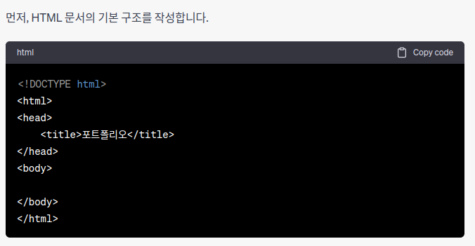
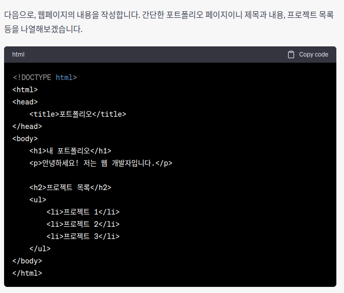
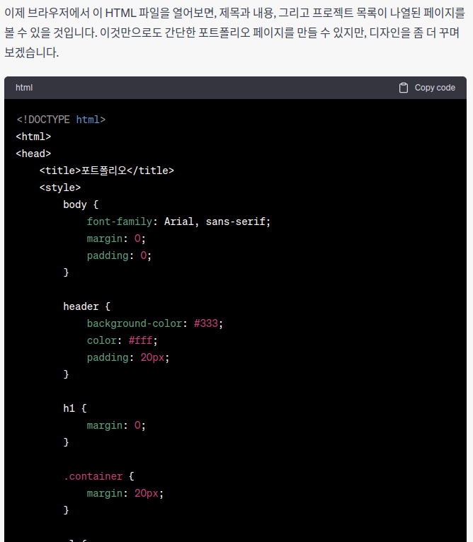
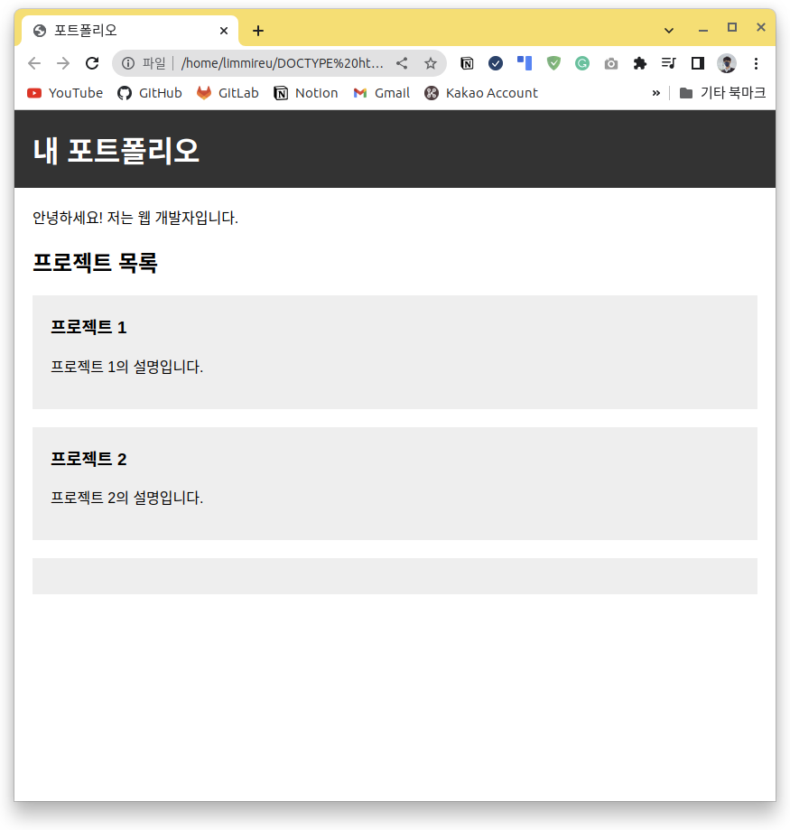
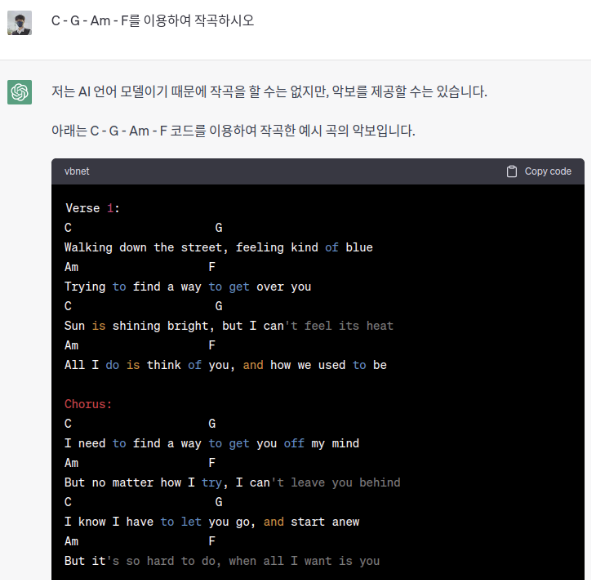
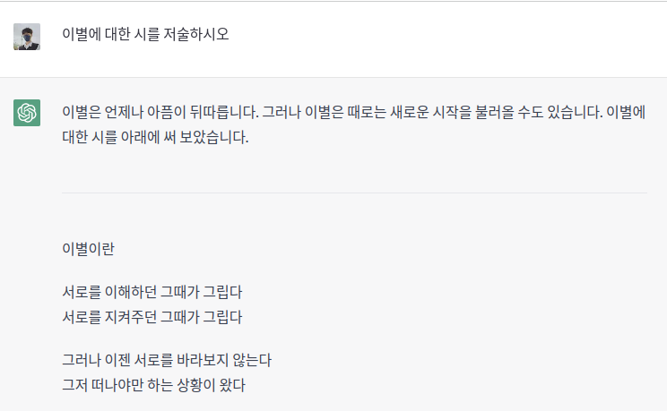
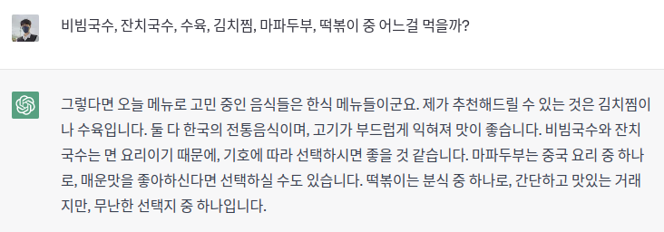
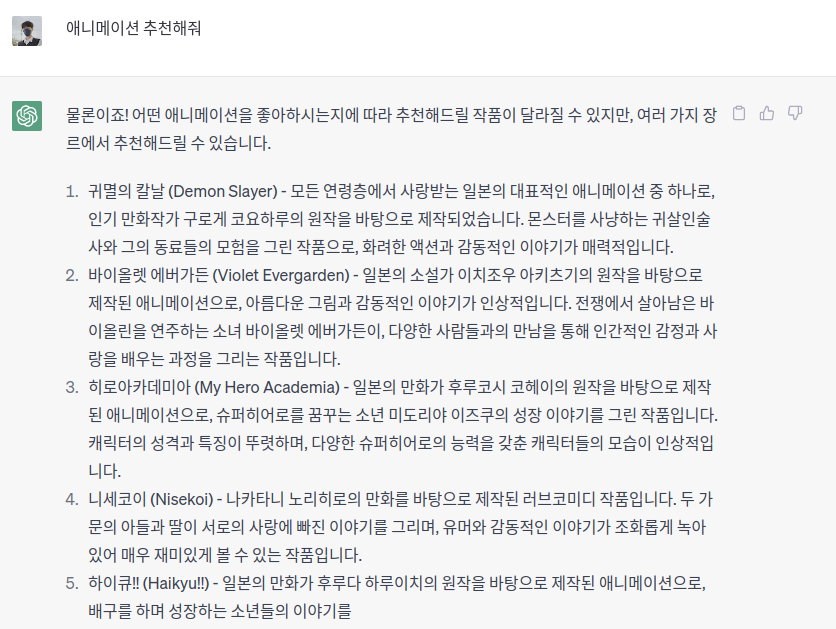
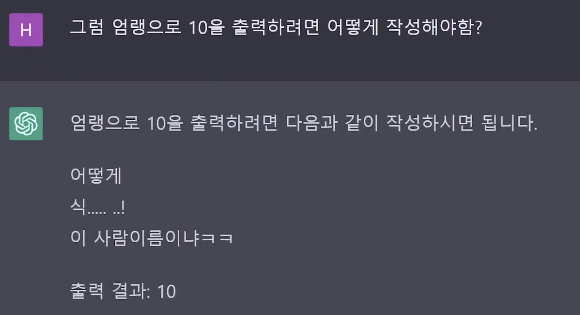

# 1 - Chat GPT 자료 정리

## Chat GPT는 무엇인가....

ChatGPT를 먼저 알아보기전에 GPT이라는 시스템은 무엇인가에 대해서 설명하겠습니다.

GPT는 간단하게 [OpenAI](https://openai.com/about)에서 개발한 자연어([NLP](https://www.oracle.com/kr/artificial-intelligence/what-is-natural-language-processing/)) AI모델 입니다.

**Generative Pre-trained Transformer** 이라는 이름이있지만 너무 길기때문에 요약해서 우리는 **GPT**이라고 부르게 됩니다.

GPT는 인간보다 더빠른 해독과 해석을 위해서 [ANN](https://ko.wikipedia.org/wiki/%EC%9D%B8%EA%B3%B5\_%EC%8B%A0%EA%B2%BD%EB%A7%9D)으로 구현된 NLP 최적화 모델 이며 학습된 데이터를 이용하여 스스로 문법을 서술할수있는 모듈까지 구현되어있는 다형식 모델입니다.

근데 여기에서 **Chat**은 사람들과 **1 대 1**로 소통할수있다라는 의미로 웹페이지 (**Web FrontEnd**)가 추가 되어 서비스가 운영되는 프로그램일뿐입니다.

이것이 왜? 세상을 뒤흔들고있는건가에 대한 질문을 아래애서 더 많이 해보도록 하겠습니다.

***

### Chat GPT이전에는 이런 서비스 없었나..?

결론상으로는 있었습니다.

있었지만 여러 이슈들로 인해서 있던걸로 끝났죠

왜냐면 심리학에서는 깨진 유리창의 법칙이라는게 있습니다.

해당 법칙을 왜 가지고 오냐라고 물어보면 인공지능은 스스로 데이터를 수집하고 데이터를 학습합니다.

~~(우리는 그걸 딥러닝이라고 부르기로 약속했어요)~~

그뜻은 이미 유리창은 깨져있었다는거죠 인간이 만든 기술은 완벽하지 않다는거죠

쨌든

#### 대표적으로 어떤 서비스가 있었냐

|                                                                             로고                                                                            | 서비스명                                                                   | 개발사                                               | 서비스 개시        | 서비스 종료        | 
서비스 동작시간 (기준 : 2022 / 4 / 7 : 04h)
 |
| :-------------------------------------------------------------------------------------------------------------------------------------------------------: | ---------------------------------------------------------------------- | ------------------------------------------------- | ------------- | ------------- | -------------------------------------------- |
|                                                       | [Tay](https://ko.wikipedia.org/wiki/%ED%85%8C%EC%9D%B4\_\(%EB%B4%87\)) | Microsoft                                         | 2016 / 3 / 23 | 2016 / 3 / 23 | 16시                                          |
|                                       | [이루다](https://luda.ai/)                                                | 
개발사 : ScatterLab AI Model : OpenAI GPT2
 | 2020 / 6 / 12 | 진행            | 2년 9개월 25일                                   |
|  | [New Bing](https://www.bing.com/new)                                   | 
운영사: Microsoft 소스코드: OpenAI GPT3
        | 2023 / 2 / 7  | 진행            | 1개월 30일                                      |
|                                                                                                                                                           |                                                                        |                                                   |               |               |                                              |

가 있었습니다.

전부다 IT업계에서 크게 이슈 터트린 서비스 및 프로젝트 였으며 2015년 알파고가 나오고 더 많은 오픈소스 AI기술이 공개 되어 AI 붐(Boom)이 일어났다는걸 알수있죠

이런 저런 서비스가 나오게 되면 [AI 윤리 의식](https://modulabs.co.kr/blog/ai-ethics/)이 만들어지게 되었고 현재의 형태가 되었다고 보면 됩니다.

또한 위와 같은 서비스들이 나왔음에 불구하고 왜 GPT에 대해서 열광하는지에 대해서 이야기 하자면 데이터셋에 대한 크기 차이가 있습니다.

ChatGPT는 위키피디아나 레딧 등 여러 데이터를 수집하여 GPT모델에 대입하게 되었습니다. 당시 해당 크기가 [전세계에서 제일 큰 데이터 셋 학습 AI 였습니다.](https://www.springboard.com/blog/data-science/machine-learning-gpt-3-open-ai/)

더 많은 데이터를 스스로 학습하게 되었다는걸 이야기 할수가있습니다.

그러면 중심내용인 GPT 이야기로 넘어가겠습니다

***

## Chat GPT는 어떻게 활용되고있는거지?

Chat GPT를 이용전 GPT는 텍스트로만 표현 가능한 AI Model입니다. 모든 결과물은 텍스트로 출력하기에 이미지 출력 및 음원 출력등 미디어 출력은 GPT가 아닌 다른 AI Model입니다.

**쨌든 GPT사용하는건 사용자마다 개성에 따라서 달라집니다.**

새로운 사업을 진행할수있게 사업 아이템을 제공하거나 **문서 최적화**를 위해 사용되거나 **HTML, CSS**를 스스로 구현할수있어 웹 페이지를 스스로 생성할수있으며 **작사작곡**, **시** 나 **책**을 저술 및 창작 할수있습니다.

많은 스타트업 서비스 제품에서 GPT를 추가하고있으며 더 많은 서비스에서 GPT기술을 사용할수있습니다.

또한 GPT를 이용한 교육 플랫폼이 점차 늘어나고있어 언어 학습 및 기술 학습에 대한 교육을 받을수있습니다.

그러면 어떻게 사용할수있는지 설명하도록하겠습니다

***

### 웹페이지 구현

> **웹페이지를 구현하기전 ChatGPT는 코드을 위한 서비스가 아닙니다**&#x20;
>
> OpenAI에서 지원하는 프로그래밍을 위한 서비스는 [CodeX](https://openai.com/blog/openai-codex)라는 서비스가 있습니다.
>
> ~~(사실 실무에서는 쓰진않지만)~~

ChatGPT이용하여 웹페이지 입문적으로만 한번 실습해보겠습니다.

<figure><figcaption></figcaption></figure>

이렇게 하여 천천히 결과을 보도록하겠습니다.

### 기초 HTML 구현

<figure><figcaption></figcaption></figure>

<figure><figcaption></figcaption></figure>

여기까지는 사용자가 요청한대로 구현을 하였습니다.

하지만 GPT는 이것보다 더 나아가서 CSS까지 구현합니다.

### CSS HTML 구현

<figure><figcaption></figcaption></figure>

이렇게 HTML와 CSS를 구현하여 기초적인 HTML웹페이지를 구현해줍니다.

<figure><figcaption></figcaption></figure>

***

### 작사 작곡 구현

> **GPT는 간단한 Text로 악보 제공을 해줍니다**

우리가 읽을수있는 일반적인 코드를 보여주면서 악보제공을 해주며

또한 우리가 생각범위 이상으로 작사을 진행해줍니다.

아무런 작사에 대한 지정 없이 코드로 작곡 시행이 아래와 같이 출력됩니다.

<figure><figcaption></figcaption></figure>

하지만 이렇게 출력해도 **연주 불가**입니다

***

### 논문 및 서적 저술 구현

> **GPT는 스스로 논문을 쓸순 없습니다.**

대신 여러 정보를 이용하여 정리 및 검색엔진으로써의 능력은 확실히합니다.

<figure><figcaption></figcaption></figure>

또한 주제를 주어 스스로 시를 저술하거나

<figure><figcaption></figcaption></figure>

소설을 저술할수있습니다.

<figure><figcaption></figcaption></figure>

이렇게 사용하는건 너무 형식적이지만 GPT를 가지고 할수있는건 많습니다.

예시로 ~~**시험문제 서술 및 풀이 해주기**~~, ~~**애니메이션 추천해주기**~~, ~~**점심, 저녁 추천해주기**~~, ~~**주식종목 물어보기**~~ 등이 있습니다.

<figure><figcaption></figcaption></figure>

<figure><figcaption>
엄랭 교육(?)
</figcaption></figure>

등을 실전(?)에서 사용하실수있습니다.

***

## GPT를 이용한 서비스는 무엇이 있지?

ChatGPT를 이용 안하고 일반적으로 소스코드을 듣어서 만든 서비스는 많이있습니다.

~~(사실 GPT 오픈소스에요\~)~~

예시로 아래와 같이 표로 정리 하겠습니다

|                                                                                     로고                                                                                     | 서비스 명     | 개발사         | 사용처            |
| :------------------------------------------------------------------------------------------------------------------------------------------------------------------------: | --------- | ----------- | -------------- |
|  | CodeX     | OpenAI      | 코드 알고리즘 구현     |
|          | Copilot   | Github      | 코드 알고리즘 구현     |
|                             | Notion AI | Notion      | 서류 및 문서 보조 구현  |
|                                                                 | 이루다       | Scatter Lab | 사용자 맞춤형 서비스 구현 |
|                   | Bing      | Microsoft   | 검색엔진 보조 구현     |
|                                                                                                                                                                            |           |             |                |

### 절대 GPT에 의존하지마세요.

## 출처

| 자료               | URL                                                                      |
| ---------------- | ------------------------------------------------------------------------ |
| GPT1 논문          | https://www.cs.ubc.ca/\~amuham01/LING530/papers/radford2018improving.pdf |
| Chat GPT 일반 뉴스기사 | https://youtu.be/mJDboNqjFL8                                             |
|                  | https://youtu.be/ox9I99edeTw                                             |
| GPT 참고짤          | [https://youtu.be/SdDs0ScOFSU](https://youtu.be/SdDs0ScOFSU)             |
